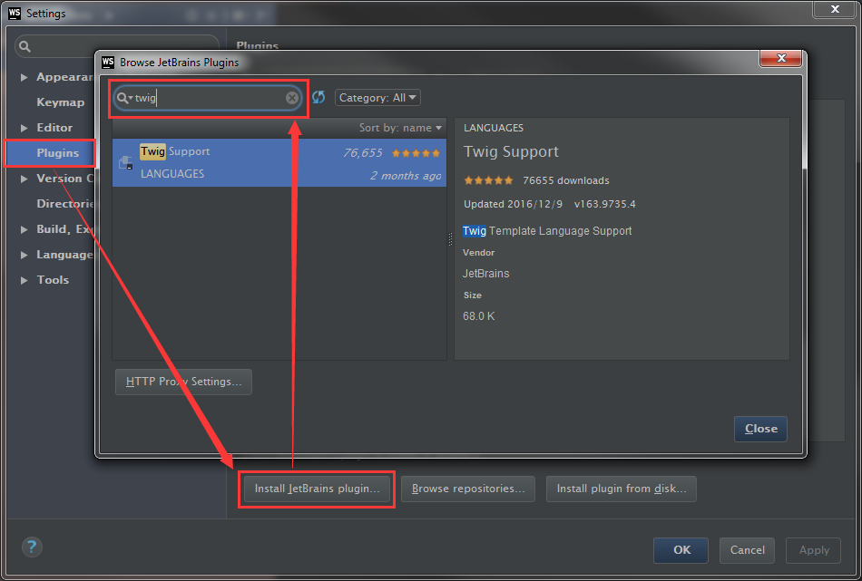
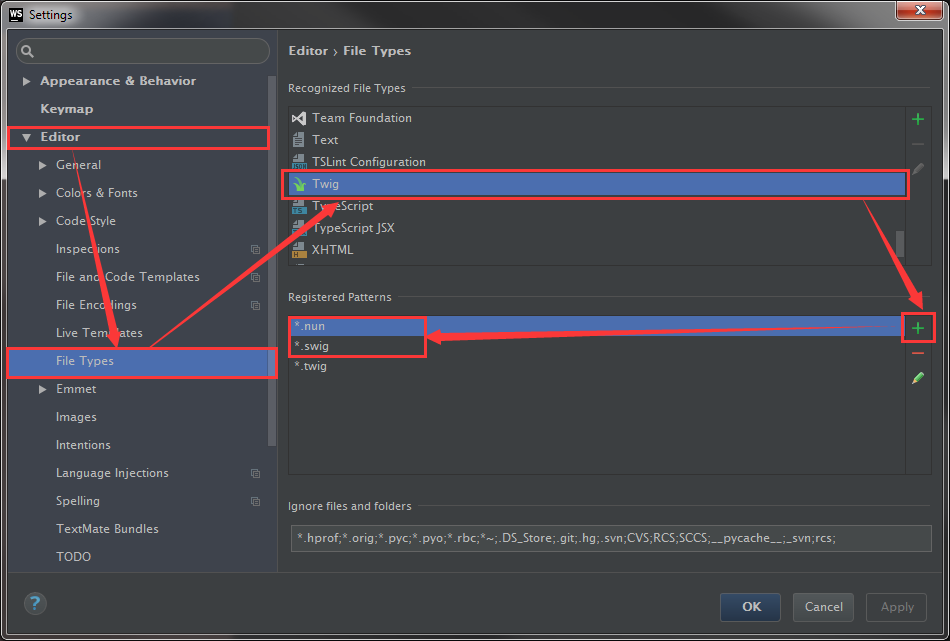

# [NexT Documentation](http://theme-next.iissnan.com/) 

这是 NexT 主题文档的源码，仅接受文档相关的问题。如果你有任何关于 NexT 主题的使用问题，请访问 [NexT 主题仓库](https://github.com/iissnan/hexo-theme-next)，谢谢。

This is the repository for **documentations** of NexT theme, it only accepts issues about documentations.
If you have any questions about using NexT, please visit [NexT repository](https://github.com/iissnan/hexo-theme-next), thanks.

----------

Welcome to contribute. Appreciate for any type of contribution。

## Development

### Requirements

1. Node.js. Download [Node.js](https://nodejs.org/en/download/)
2. Gulp Cli. Run `npm install --global gulp-cli`
3. Project Dependencies. Run `npm install`

### Running Up

After all project dependencies have been resolved, run `gulp` in the project root directory to kick off a local server. 
This server (using BrowserSync) will listen on port `3000`, visit `http://localhost:3000` to see the documentations.

### Project Structure

Directory/File | Description |
----------| ------------|
app       | Application main directory which contains documentations and site assets |
 ├── assets| Site assets |
 ├── en    | English documentations |
 ├── templates| Documentation layouts |
 ├── uploads | Images used in documentations |
gulp        | Gulp library |
 ├── dev-server-middleware | Middleware for BrowserSync |
 ├── tasks  | Gulp tasks |
lib         | Application library |
 ├── tags  | Nunjunks tags used in documentations to ease writing |
 ├── configs.js | Parse config from `app/config.yaml` | 
 ├── renderer.js | Nunjunks Renderer |
 ├── utils.js | Various utilities |
webpack     | Webpack configuration for different environments |
 ├── common.js | Webpack configuration for all environments |
 ├── dev.js | Webpack configuration of development |
 ├── pro.js | Webpack configuration of production |
.editorconfig | EditorConfig configuration |
.travis.yml  | Configuration for TravisCI |
bower.json   | Front-end library dependency management |
gulpfile.js  | Gulp tasks definition |
package.json | Package Information |
tsconfig.json | Typescript configuration file |

### Syntax Highlight Support of WebStorm for Nunjucks Template

To make WebStorm to recognize Nunjucks templates, follow the following steps:

1. Install `Twig` Plugin from JetBrains Plugin Repository.

    
    
2. Add Nunjucks template extension to the `Twig` file type.

    
    
    In this repo, `.njk` extension is used for Nunjucks Template, so add it to the `Registered Pattern`.
